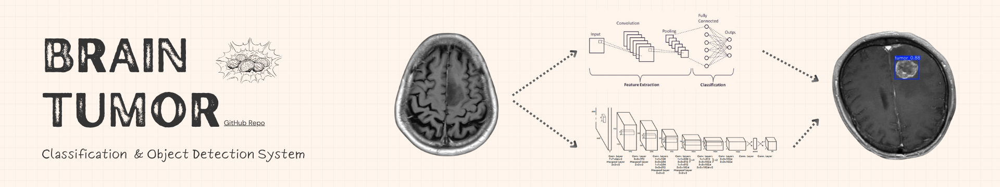

# Brain Tumor Detection and Classification using Deep Learning

This project was developed as the **graduation project** for the **Digital Egypt Pioneers Initiative (DEPI)** – Microsoft Machine Learning Engineer Track. It combines advanced deep learning models for the **classification** and **detection** of brain tumors using MRI scans.

## 🧠 Project Overview

- **Classification Model:** EfficientNetB5
- **Detection Model:** YOLOv8
- **MRI Modalities:** T1-weighted, contrast-enhanced T1 (T1C), and T2-weighted
- **Tumor Types:** 15 major categories grouped from 44 subtypes

---

## 📁 Dataset

### 🧪 Classification Dataset

- **Source:** [Brain Tumor MRI Images – 44 Classes (Kaggle)](https://www.kaggle.com/datasets/fernando2rad/brain-tumor-mri-images-44c)
- **Description:** A private, de-identified collection of MRI scans (T1, T1C, and T2) labeled by expert radiologists.
- **Tumor Subtypes:** Astrocytoma, Carcinoma, Ependymoma, Ganglioglioma, Germinoma, Glioblastoma, Granuloma, Medulloblastoma, Meningioma, Neurocytoma, Oligodendroglioma, Papilloma, Schwannoma, Tuberculoma
- **Challenge:** Severe class imbalance
  - ✅ Addressed with data augmentation, oversampling, class weighting, and stratified splitting

### 🎯 Object Detection Dataset

- **Source:** [Brain Tumors Detection Project (Roboflow Universe)](https://universe.roboflow.com/test-svk7h/brain-tumors-detection)
- **Description:** Annotated MRI images with bounding boxes for tumor localization
- **Used For:** Training YOLOv8 model for real-time detection

---

## 🧪 Classification Pipeline

### ✅ Model Exploration

- ResNet family (18, 34, 50, 101, 152)
- DenseNet
- EfficientNet family (B0 to B5)
- 🔍 **Final model:** EfficientNetB5

### 🔧 Preprocessing

- Grayscale-to-RGB conversion for CNN compatibility
- Normalization and resizing
- On-the-fly augmentation with a custom data generator

### 🧩 Model Architecture

- **Base:** EfficientNetB5 (with global pooling)
- **Custom Head:**
  - BatchNormalization
  - Dense(256, ReLU) + Dropout(0.45)
  - Softmax layer for 15-class output

### 🧠 Training Strategy

- Loss: `categorical_crossentropy`
- Optimizer: `Adam` (lr = 0.001)
- Enhancements:
  - Early stopping
  - Learning rate scheduler
  - Custom training callback (`MyCallback`) with interactive and automated controls

---

## 🎯 Object Detection Pipeline

### 🔍 Detection Model: YOLOv8

- Chosen for anchor-free design, speed, and robustness
- Trained on annotated bounding boxes from the Roboflow dataset

### 📊 Evaluation Metrics

- **Precision:** 91.24%
- **Recall:** 89.63%
- **mAP@0.5:** 96.27%
- **mAP@0.5:0.95:** 71.39%
- **Fitness Score:** 73.88%

### 🧰 Output

- Exported weights: `best.pt`
- Deployment-ready ONNX model

---

## 🚀 Deployment

The complete pipeline was deployed using a **Flask** web application, enabling:

- Uploading MRI scans
- Tumor type prediction
- Visualization of detection results with bounding boxes

---

## 👥 Team Contributions

- 📚 Classification: Model selection, training strategies, and evaluation
- 🎯 Detection: Data annotation, YOLOv8 integration, and analysis
- 🛠️ Preprocessing: RGB conversion, augmentation, and data handling
- 🌐 Deployment: Full-stack web app using Flask

---

## 🎓 Project Context

This project was developed as part of the **Digital Egypt Pioneers Initiative (DEPI)** in collaboration with **Microsoft** for the **Machine Learning Engineer Track**. It demonstrates the power of AI in medical imaging and clinical decision support.

---

## 📚 References

- **Classification Dataset:** [Kaggle - Brain Tumor MRI Images (44 Classes)](https://www.kaggle.com/datasets/fernando2rad/brain-tumor-mri-images-44c)
- **Detection Dataset:** [Roboflow Universe - Brain Tumors Detection](https://universe.roboflow.com/test-svk7h/brain-tumors-detection)
- [EfficientNet Paper (arXiv:1905.11946)](https://arxiv.org/abs/1905.11946)
- [Ultralytics YOLOv8 Documentation](https://docs.ultralytics.com/)
- [TensorFlow](https://www.tensorflow.org/)
- [Keras Applications](https://keras.io/api/applications/)

---

## ⚖️ License

This project is intended for **educational and research purposes only**. All datasets used are anonymized and ethically sourced.
